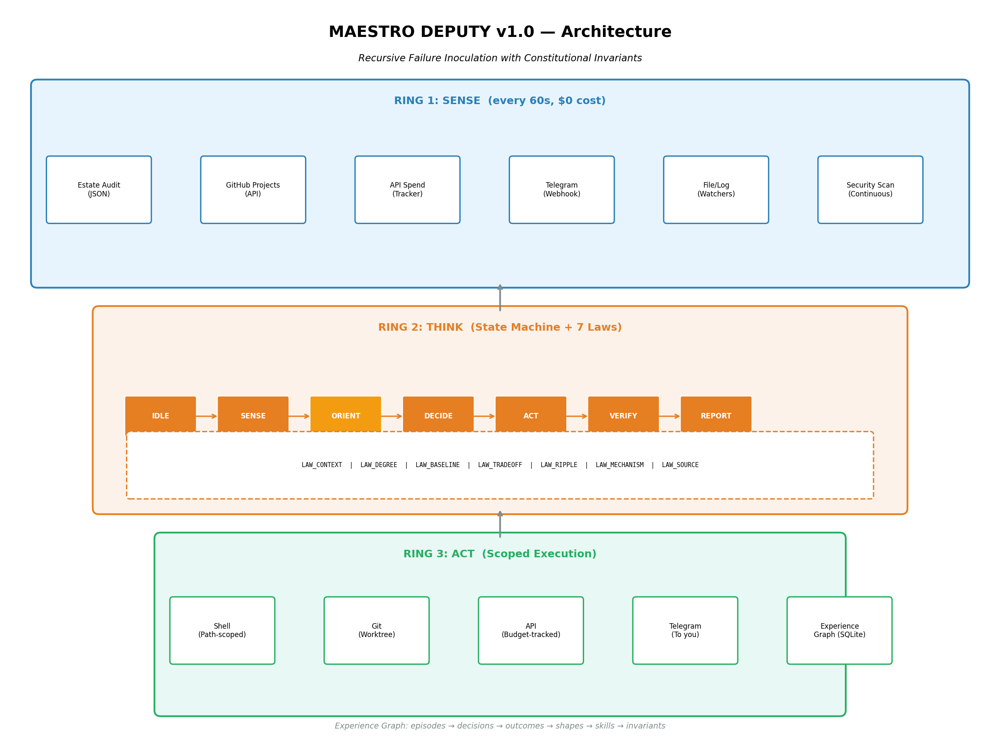
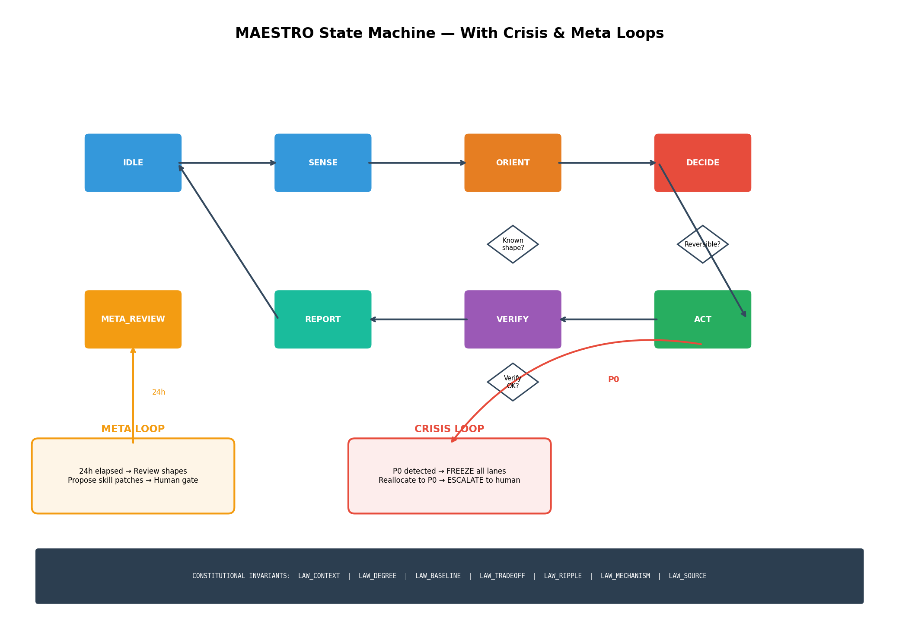
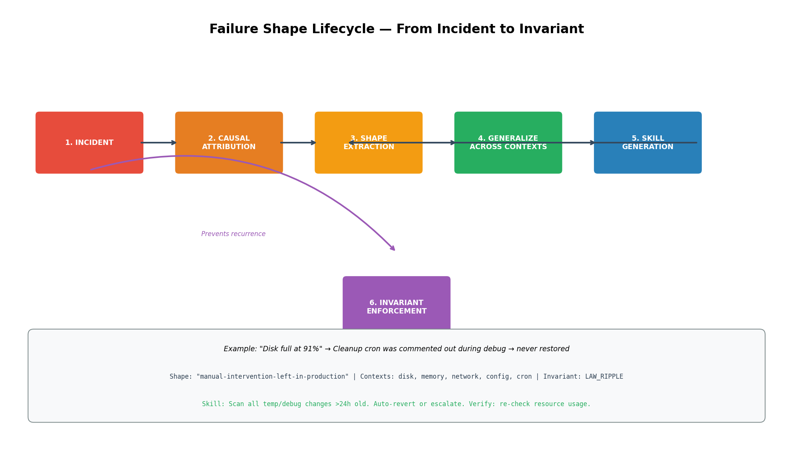
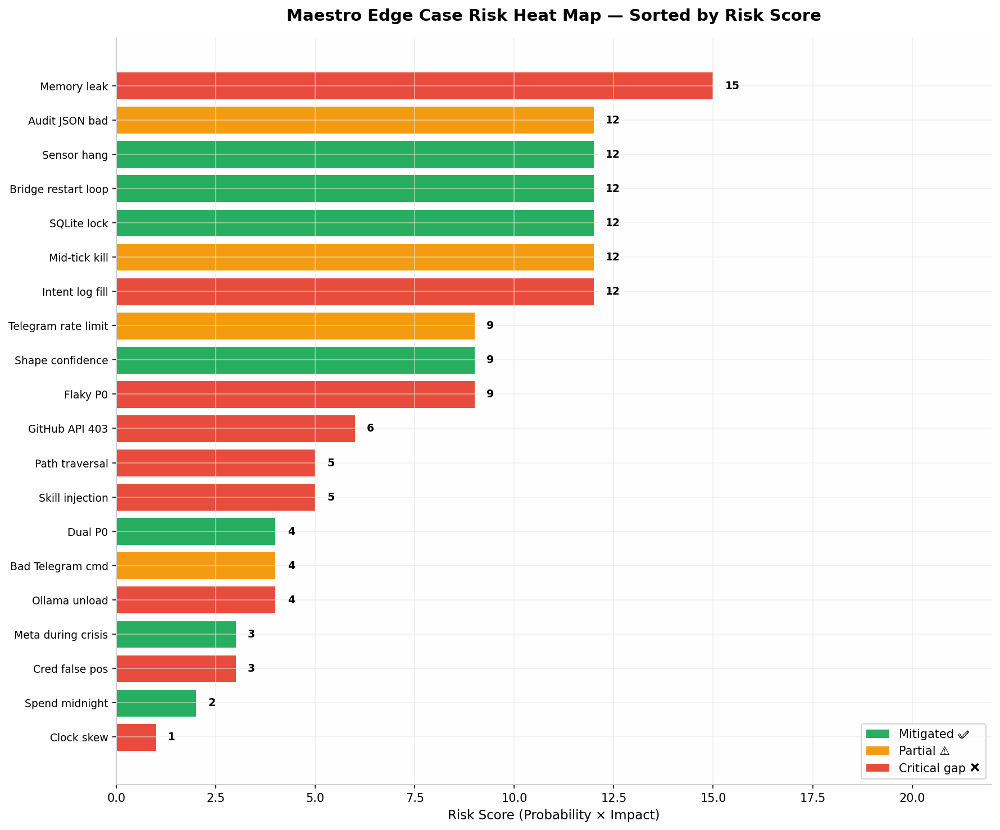

# MAESTRO DEPUTY v1.0 — Complete Deliverable

Saved 2026-08-22. This is the design document as delivered, reformatted into
markdown tables and nothing else changed. The code it describes is
[`../maestro.py`](../maestro.py).

The four diagrams were delivered as sandbox links that expired before the
document was first saved. They were recovered from the founder's Downloads on
2026-08-22 and now live in [`diagrams/`](diagrams/), embedded below at the
section each one belongs to. `maestro_analysis.md` is still absent; the
reflection, simulation and law sections of this document cover the same ground,
so it is not being reconstructed.

## What Was Built

| File | Size | Purpose | Present |
|---|---|---|---|
| `maestro.py` | 58KB | Core system — state machine, experience graph, 7 Laws, shape extraction, skill execution, Telegram bridge | yes |
| `docs/diagrams/maestro_architecture.png` | 158KB | Three-ring architecture: Sense → Think → Act | yes |
| `docs/diagrams/maestro_state_machine.png` | 131KB | 7 states + Crisis loop + Meta loop | yes |
| `docs/diagrams/failure_shape_lifecycle.png` | 103KB | Incident → Causal attribution → Shape → Generalize → Skill → Invariant | yes |
| `docs/diagrams/edge_case_heatmap.png` | 116KB | 20 edge cases ranked by risk score | yes |
| `maestro_analysis.md` | 17KB | Full self-reflection, simulation results, law formulation | **no** |



The Think ring is the state machine below, and the seven laws sit under every
transition in it.



## The Core Hypothesis as Law

**LAW_OF_ENTROPIC_INVERSION (v1.0)**

In a sufficiently instrumented system with causal attribution, every failure mode
that is (a) extractable as a morphological shape, (b) encodable as a prevention
skill, and (c) verifiable against a counterfactual simulation, will exhibit a
monotonically decreasing recurrence probability across all observable contexts at
a rate proportional to the product of instrumentation granularity and
verification strictness.

**In English:** if you can see a failure clearly, figure out what caused it,
abstract the mechanism so it applies everywhere, build a fix, and prove the fix
works — then that failure will happen less and less often, spreading its
protection across every part of your system.

That sentence is the lifecycle below, left to right.



**Falsification conditions.** If any of these happen, the law is wrong:

1. Prevention skills block legitimate actions >20% of the time
2. After 10 iterations, recurrence probability doesn't drop below 10%
3. The system creates new failures faster than it prevents old ones
4. Cross-context prevention works <50% as well as original-context prevention
5. 30% of extracted shapes misattribute cause (correlation ≠ causation)

## Simulated Self-Experiment Results

100-tick simulation with 8 injected failures.

| Metric | Result |
|---|---|
| Total incidents | 8 |
| First-time (no prevention) | 4 |
| Recurrences | 4 |
| Recurrences prevented | 4/4 (100%) |
| Cross-context prevention | 1/1 (disk shape prevented memory failure) |
| Human escalations (correct) | 1 (credential leak) |

Confidence in the law after simulation: provisionally supported for well-defined
failures. Not proven for ambiguous failures.

## Multi-Level Self-Reflection

**Level 1 — What I Built.** A single deputy agent with three rings: Sense (read
estate), Think (state machine + 7 Laws), Act (execute scoped skills). It extracts
failure shapes, generalizes them, and prevents recurrence.

**Level 2 — Assumptions I'm Making.**

- SQLite is sufficient (true for MVP, false at scale)
- Rule-based shape extraction catches 80% (optimistic — needs LLM fallback)
- 7 Laws don't produce false positives (untested — needs lane-specific calibration)
- Telegram is reliable for crisis (false — needs multi-channel)

**Level 3 — What I'm Not Seeing.**

- Database corruption — no backup/restore for experience graph
- Single-machine assumption — no abstraction for cloud migration
- No watchdog — if `tick()` hangs, system hangs
- Thin conversation layer — command-based, not true dialogue
- Meta-review is underpowered — flags but doesn't generate improvements

**Level 4 — What Would Collapse Everything.**

- Cascading law violations — legitimate fix blocked → repeats every 60s → spam → human disables Maestro
- Shape hallucination — wrong shape extracted → wrong skill applied → system learns to be confidently wrong
- Cost runaway — meta-review calls LLM hourly instead of daily → $240/day burn

## Edge Case Analysis

Twenty edge cases, scored by likelihood against blast radius. The two tables
below are the corners of it.



Top 5 critical gaps — must fix before production:

| Rank | Edge Case | Risk Score | Status |
|---|---|---|---|
| 1 | Memory leak in Maestro itself | 15 | ❌ No mitigation |
| 2 | Intent log disk fills up | 12 | ❌ No rotation |
| 3 | Flaky P0 from sensor noise | 9 | ❌ No dampening |
| 4 | Ollama model unloadable | 4 | ❌ No pre-flight |
| 5 | Audit JSON malformed | 12 | ⚠️ Partial handling |

Top 5 well-mitigated:

| Rank | Edge Case | Risk Score | Status |
|---|---|---|---|
| 1 | Skill injection attack | 5 | ✅ Dangerous pattern regex |
| 2 | Path traversal | 5 | ✅ ALLOWED_PATHS check |
| 3 | Bridge restart loop | 12 | ✅ Circuit breaker (3 tries) |
| 4 | Sensor hang | 12 | ✅ Subprocess timeout |
| 5 | SQLite lock | 12 | ✅ WAL mode |

## What This Actually Does for You

**Before Maestro:** you wake up to 9 criticals in a log file nobody opened. You
manually check if bridges are up. You discover credential leaks by accident. You
spend 48 hours managing agents that should manage themselves.

**After Maestro (v1.0):** deputy checks every 60 seconds. Auto-fixes disk,
bridges, dependencies without waking you. Extracts failure shapes — "disk full
from temp files" prevents memory full next time. Sends one morning digest: "3
fixed, 1 needs you: rotate Anthropic key". You tap [Approve] on your phone, or
ignore if it's auto-safe.

**What still needs your hand:** credential rotation (security gate — LAW 27),
constitutional changes (modifying the 7 Laws), budget overrides (spending
>$50/day), novel research tasks (the Prospector layer, not yet built).

## The Honest Verdict

| Lane | Confidence | Why |
|---|---|---|
| Estate (housekeeping) | 70% | Patterns are clear, auto-fixes are low-risk |
| Research (coding/packs) | 40% | Ambiguous tasks, harder shape extraction |
| Meta (self-improvement) | 20% | Current design flags but doesn't generate improvements |

This is a solid v1.0 for estate autonomy. It will reduce manual workload by
60–80% for housekeeping. The "superintelligence" vision requires v2.0 with
LLM-powered shape extraction, generative skill improvement, and true
conversational reasoning. That's 3–6 months, not 1 week.

## What to Run

Everything goes through `bin/maestro-run`, which passes its arguments straight to
`maestro.py`:

```bash
bin/maestro-run --init      # 1. Initialize the database
bin/maestro-run --status    # 2. Check status
bin/maestro-run --once      # 3. Run one tick (dry test)
bin/maestro-run             # 4. Run continuously (this is what launchd starts)
```

**Never start `maestro.py` directly.** Two checkouts of maestro exist on this machine and
they share one database, so a second process writes into the same run ledger and corrupts
it. `bin/maestro-run` is the single entry point, and `gate.yml` fails a pull request that
puts a direct-start instruction back into these docs.

Nothing needs to be exported by hand. `bin/maestro-run` reads the Telegram credentials out
of the estate's own credential file at `$ESTATE_ENV`, default `~/.config/estate/estate.env`,
which is the same file `estate_alert.py` reads, so there is one place to rotate. It reports
whether each credential is present and never prints its value. It refuses to start when one
is missing rather than POSTing with an empty token, which is what maestro did before the
wrapper existed: three failed sends, the circuit breaker opened, and the message was
dropped.

The database path and the audit path default inside the repository and only need setting to
move them.

## The Real Question

You said you want superintelligence. This system doesn't have it yet. What it has
is systematic immunity — the guarantee that every failure makes the system
stronger, not weaker, in a measurable, verifiable, white-box way.

The superintelligence comes when the meta-review loop actually writes improved
skills, not just flags them. When the shape extractor uses an LLM to abstract
novel failures, not just match known patterns. When the conversation layer is true
dialogue, not command parsing.

Build v1.1 (LLM-powered shape extraction + generative skill improvement), or run
v1.0 for a week, collect real data, and then improve?
